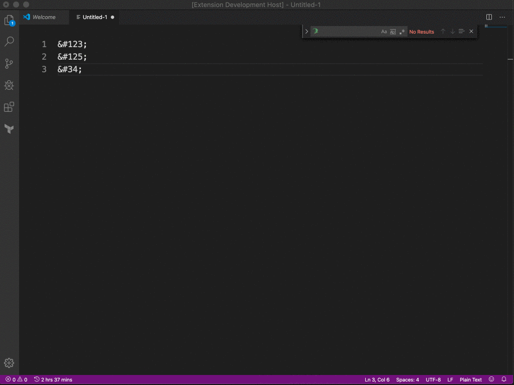

# Escape Entities for VS Code

Escape HTML Entities for react to be compatible with eslint-plugin-react/no-unescaped-entities.

## Features

Promp the command pallet and type "Escape Entities" with a text selected. It should replace with the correct unicode char.

## Extension Settings

No settings for noe

## Known Issues

- Some special chars, like emojis won't show the correct number. Right now the code is very generic, there's no BIG list of unicode chars.

## Release Notes

Users appreciate release notes as you update your extension.

### 0.0.1

- Initial release. 